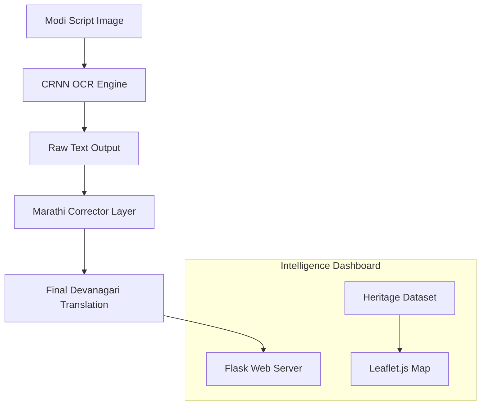

# GeoLipi AI: Modi Script Translation & Historical Intelligence 🏛️📜

[](https://www.python.org/)
[](https://pytorch.org/)
[](https://flask.palletsprojects.com/)
[](https://streamlit.io/)
[](https://opensource.org/licenses/MIT)

An advanced, AI-driven ecosystem designed to preserve, interpret, and digitize the historic **Modi Lipi** script. GeoLipi AI bridges the gap between ancient Maratha Empire records and modern linguistic understanding through cutting-edge Deep Learning and interactive Geospatial intelligence.

---

## 🌟 Project Overview

Modi Lipi was the primary script used for writing the Marathi language for centuries, especially during the Maratha Empire. Today, only a handful of experts can read it. **GeoLipi AI** democratizes access to these historic records by providing:

1.  **Automated Transcription**: Converting complex Modi ligatures to Devanagari.
2.  **Linguistic Intelligence**: Correcting OCR errors using Marathi phonetics and dictionary mapping.
3.  **Historical Context**: Mapping historical sites where these scripts were prevalent.

---

## 🏗️ System Architecture



---

## 🚀 Key Features

### 1. 📜 High-Accuracy Script Translator
Uses a custom-mapped translation engine that handles the intricate stroke patterns of Modi Lipi, converting them into readable Devanagari in real-time.

### 2. 👁️ CRNN-Based OCR Engine
A Convolutional Recurrent Neural Network (CRNN) built with PyTorch. It utilizes CNN layers for feature extraction and GRU/LSTM layers for sequential character recognition, specifically tuned for the cursive nature of Modi script.

### 3. ✍️ Marathi Linguistic Layer
Implements an intelligent post-processing algorithm using **Levenshtein Distance** to cross-reference OCR outputs with a specialized Marathi dictionary, significantly reducing character misidentification.

### 4. 🗺️ Heritage Explorer Dashboard
An interactive map featuring **30+ historical heritage sites** (Forts, Palaces, Temples). Users can explore historical data, view artifacts, and get AI-driven insights via the "Magic Wand" feature.

---

## 🛠️ Technology Stack

| Component | Technology |
| :--- | :--- |
| **Deep Learning** | PyTorch, CRNN Architecture |
| **Backend** | Flask (Dashboard), Streamlit (Translator) |
| **Frontend** | HTML5, CSS3, Leaflet.js (Mapping) |
| **NLP** | Levenshtein Distance, Custom Phonetic Mapping |
| **Storage** | JSON, CSV-based Metadata |

---

## 📦 Installation & Setup

### 1. Clone the Repository
```bash
git clone https://github.com/sanglekrushna/GeoLipi-AI-Modi-Script-Translation-and-Historical-Intelligence-System.git
cd GeoLipi-AI-Modi-Script-Translation-and-Historical-Intelligence-System
```

### 2. Set Up Environment
```bash
python -m venv venv
# Windows:
venv\Scripts\activate
# Linux/Mac:
source venv/bin/activate
```

### 3. Install Requirements
```bash
pip install -r requirements.txt
```

### 4. Launch Applications
*   **Intelligence Dashboard**: `python app.py` (Runs on port 5000)
*   **Script Translator**: `streamlit run streamlit_app.py` (Runs on port 8501)

---

## 📂 Repository Structure

```text
├── app.py                  # Main Flask server (Dashboard)
├── streamlit_app.py        # Streamlit interface (Translator)
├── crnn_model.py           # Neural network architecture
├── marathi_corrector.py    # Spell-check and NLP logic
├── translator/             # Core translation mapping files
├── utils/                  # Utility functions and matchers
├── static/                 # CSS, JS, and Heritage Images
└── data/                   # Historical JSON/CSV datasets
```

---

## 🤝 Contributing
We are committed to preserving historical heritage. If you have expertise in Modi Lipi, Paleography, or Machine Learning, we welcome your contributions!

1. Fork the Project
2. Create your Feature Branch (`git checkout -b feature/AmazingFeature`)
3. Commit your Changes (`git commit -m 'Add some AmazingFeature'`)
4. Push to the Branch (`git push origin feature/AmazingFeature`)
5. Open a Pull Request

---

## 📄 License
Distributed under the MIT License. See `LICENSE` for more information.

---
**Developed with ❤️ for History and AI.**
